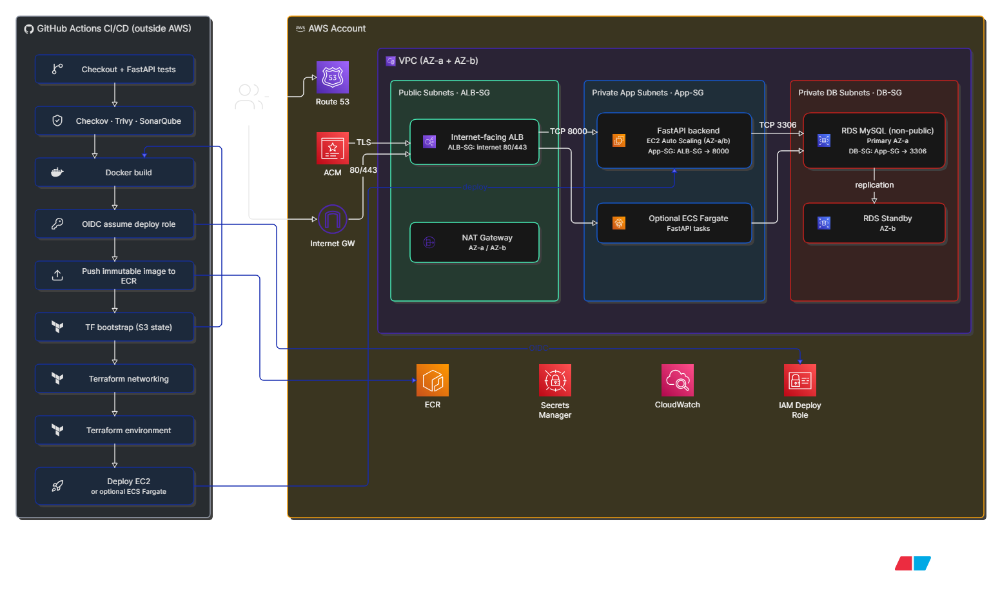

# AWS 3-Tier GitHub Actions

Three-tier FastAPI/MySQL application deployed through Terraform and GitHub Actions. The repository contains EC2 and ECS Fargate deployment demonstrations behind Application Load Balancers.

## Architecture



The `dev` environment is the demo target. GitHub Actions uses OIDC to assume an AWS role; no long-lived AWS keys are required.

## HTTPS and DNS

Only one domain is required. For example, buy `example.com`, create a public Route 53 hosted zone, and use separate subdomains:

```text
ec2-dev.example.com
ecs-dev.example.com
```

Set these GitHub Environment variables under `dev`:

```text
HOSTED_ZONE_NAME=example.com
EC2_DOMAIN_NAME=ec2-dev.example.com
ECS_DOMAIN_NAME=ecs-dev.example.com
ENABLE_NAT_GATEWAY=true
```

If the domain is registered outside Route 53, update its nameservers to the Route 53 hosted-zone nameservers. Terraform creates ACM certificates, DNS validation records, Route 53 aliases, HTTPS listeners, and HTTP-to-HTTPS redirects.

## Demo deployment order

1. Run `Infrastructure - Bootstrap State`.
2. Run `CD - Infrastructure` with target `networking` and operation `apply`.
3. Copy the published `sha-<commit>` image tag from ECR.
4. Run `CD - Infrastructure` with target `ec2`, environment `dev`, that image tag, and operation `apply`.
5. Run `CD - Infrastructure` with target `ecs`, environment `dev`, that image tag, and operation `apply`.
6. Test both HTTPS URLs and `/healthz`.

Use immutable ECR image tags for repeatable deployments.

## CI/CD stages

- `CI - Quality and Security`: tests, linting, Terraform format/validation, Checkov, Trivy, SonarQube, image health check, and SBOM generation.
- `Publish - Application Image`: runs only after a successful CI run on `main` and pushes the exact image CI tested and scanned.
- `CD - Infrastructure`: dynamically targets `networking`, `ec2`, or `ecs` and supports `plan`, `apply`, and `destroy`, followed by an HTTPS smoke test for application targets.
- `Test - EC2 Load and Scaling`: send sustained traffic and report ASG capacity and recent scaling activity.

For the scaling demo, set `MIN_SIZE=1` and `MAX_SIZE=2` in the `dev` GitHub Environment. Run the load test against a real application endpoint, such as `https://ec2-dev.example.com/api/products`, for several minutes.

To remove the demo infrastructure safely, run `destroy` in reverse dependency order: target `ecs`, target `ec2`, then target `networking`. Keep the bootstrap state bucket until all other Terraform states have been destroyed.

## Repository layout

```text
app/                  # FastAPI application and tests
infra/terraform/      # Shared VPC, RDS, EC2, and ALB infrastructure
deploy/               # ECS deployment assets
.github/workflows/    # Build, security, and Terraform workflows
```
