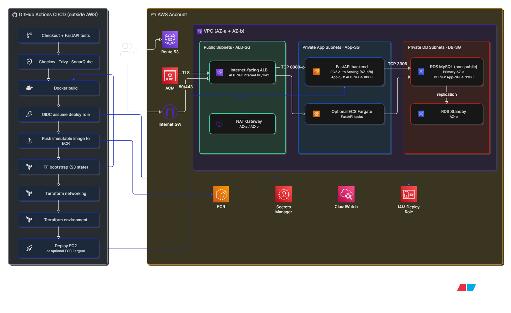

# AWS 3-Tier Application Deployment

.
├── .github/workflows/
│   ├── ci.yml                    # Tests, linting, security checks
│   ├── cd.yml                    # Deployment workflow
│   ├── infrastructure-bootstrap.yml
│   ├── load-test.yml             # ApacheBench EC2/ALB load test
│   └── publish-image.yml         # Builds/publishes Docker image
│
├── app/backend/
│   ├── main.py                   # FastAPI application and API routes
│   ├── Dockerfile                # Backend container image
│   ├── requirements.txt          # Runtime dependencies
│   ├── requirements-dev.txt      # Test/development dependencies
│   ├── static/index.html         # Basic frontend/static page
│   ├── tests/test_api.py         # API tests
│   └── .env.example              # Example local environment variables
│
├── infra/terraform/
│   ├── main.tf                   # Main AWS infrastructure composition
│   ├── variables.tf              # Root Terraform variables
│   ├── versions.tf               # Terraform/provider versions
│   │
│   ├── modules/
│   │   ├── alb/                  # Application Load Balancer and target groups
│   │   ├── networking/           # VPC, subnets, routing, NAT/IGW
│   │   └── security-groups/      # ALB, EC2, RDS security groups
│   │
│   ├── bootstrap/                # Terraform state backend/bootstrap resources
│   └── networking/               # Separate networking Terraform configuration
│
├── deploy/
│   ├── ecs/
│   │   ├── main.tf               # ECS/Fargate deployment
│   │   ├── variables.tf
│   │   ├── outputs.tf
│   │   └── README.md
│   │
│   └── ec2/
│       └── README.md             # EC2 deployment notes
│
├── docs/
│   ├── diagram.png               # Architecture diagram
│   └── presentation-cheatsheet.md
│
├── README.md                     # Project overview and setup
├── .checkov.yaml                 # Checkov security-scan configuration
├── .trivyignore                  # Trivy vulnerability exceptions
└── sonar-project.properties      # SonarQube configuration

SAST:
  SonarQube

DAST:
  None currently

IaC security:
  Checkov

Dependency/filesystem security:
  Trivy filesystem

Container security:
  Trivy image scan

Secret detection:
  Trivy filesystem and image scans

SBOM:
  Anchore SBOM

Functional testing:
  Pytest

Performance testing:
  ApacheBench
  
## Demo purpose

This lab demonstrates an automated AWS deployment of a FastAPI/MySQL application using two compute models:

- EC2 instances managed by an Auto Scaling Group.
- ECS Fargate tasks managed by an ECS service.

Both deployments use the same container image and connect to the same private RDS MySQL database.

## Architecture summary

```text
Route 53 → ACM certificate → HTTPS Application Load Balancer
                                  ├─ EC2 Auto Scaling Group → FastAPI container
                                  └─ ECS Fargate service → FastAPI task
                                                        ↓
                                      Secrets Manager → RDS MySQL
```

The `dev` environment is the demonstration environment. The public endpoints are:

```text
https://ec2-dev.cloudbatch818.click/healthz
https://ecs-dev.cloudbatch818.click/healthz
```

## Six-minute presentation talk track

### Business value and product

“This project delivers a small FastAPI/MySQL product application, but the main engineering value is the delivery platform around it. The same tested release can run on EC2 or ECS across dev, test, and prod without manually configuring servers.”

“That gives an engineering team repeatable infrastructure, traceability from code to deployment, a clear security boundary, and a practical choice between host-level control and managed container operations.”

The application provides a static frontend, product API endpoints, `/healthz` for process health, and `/readyz` for database readiness.

### Technology choices

“The application is Python FastAPI packaged as a Docker image. Terraform defines AWS infrastructure, GitHub Actions provides CI/CD, RDS MySQL provides managed relational storage, ECR stores images, Secrets Manager protects credentials, and CloudWatch provides operational visibility.”

The repository separates application code, Terraform infrastructure, ECS deployment assets, and GitHub Actions workflows.

### Infrastructure and traffic flow

“The infrastructure uses a three-tier network across two Availability Zones. Public subnets host the Application Load Balancer. Private application subnets host EC2 instances or ECS tasks. Private database subnets host RDS.”

Show the architecture diagram here and walk across it from left to right:



Start at Route 53 and ACM, then follow the request to the public ALB. The ALB routes to either the EC2 Auto Scaling Group or the ECS Fargate service. Both application paths retrieve database credentials from Secrets Manager and connect to the private RDS MySQL database.

```text
Browser → Route 53 → ALB on 80/443 → FastAPI on 8000 → RDS MySQL on 3306
```

“The security groups enforce this flow. The ALB accepts public HTTP and HTTPS. The application tier accepts port 8000 only from the ALB. RDS accepts port 3306 only from the application tier. The browser never connects directly to the database.”

Credentials are retrieved from Secrets Manager through IAM roles. NAT provides controlled outbound access for private resources when required.

### EC2 and ECS deployment models

“The same image is deployed two ways. EC2 gives host-level control: Terraform creates a launch template and Auto Scaling Group, user data installs Docker, and the instance pulls the image from ECR. ECS Fargate removes host management: ECS places tasks, maintains the desired count, replaces unhealthy tasks, and supports rollback through a deployment circuit breaker.”

### CI/CD and release process

“Feature branches go through pull-request validation into main. CI runs tests, linting, Terraform validation, Checkov, Trivy, Docker health checks, image scanning, SBOM generation, and SonarQube analysis.”

“After CI succeeds on main, the exact tested image is published to ECR with an immutable `sha-<commit-sha>` tag. Deployment uses that image through Terraform. This prevents a moving `latest` tag from changing underneath a deployment and gives traceability back to the source commit.”

### Observability and conclusion

“CloudWatch collects application and database logs and monitors ALB 5xx errors, p95 latency, EC2 CPU, ECS CPU, and running task count. The load-test workflow lets me correlate traffic with latency, errors, CPU, and scaling activity.”

“The result is a platform an engineering team can operate: repeatable infrastructure, controlled releases, private data access, immutable artifacts, two compute options, and enough telemetry to explain system behavior.”

## Detailed reference talk track

Use this as a spoken script. The timing is approximate; the headings are prompts, not slides that must be read word-for-word.

### Project overview

“This project deploys the same FastAPI/MySQL application in two AWS compute models: EC2 with an Auto Scaling Group and ECS Fargate. The goal is to demonstrate a repeatable, secure deployment pipeline rather than manually configured servers.”

Traffic enters through Route 53 and an Application Load Balancer. The ALB routes requests to either the EC2 container or the ECS service. Both application paths connect to one private RDS MySQL database.

The application has two useful endpoints: `/healthz` checks whether the process is alive, while `/readyz` checks database readiness.

### Repository and infrastructure reference

“The repository is organized into application code, Terraform infrastructure, deployment configurations, and GitHub Actions workflows.”

- `app/backend`: FastAPI application, Dockerfile, dependencies, and tests.
- `infra/terraform`: shared environment infrastructure such as VPC-related resources, ALB, security groups, RDS, EC2, alarms, and logging.
- `deploy/ecs`: ECS-specific Fargate cluster, task definition, service, logs, and alarms.
- `.github/workflows`: CI, image publication, infrastructure deployment, and load testing.

Terraform is environment-aware through `dev`, `test`, and `prod` variables. Remote state separates shared networking from environment-specific infrastructure.

### CI/CD reference

“A change first goes through quality and security checks before it can be deployed.”

The CI workflow runs linting, pytest, Terraform validation, Checkov, Trivy filesystem and secret scans, a Docker build, a container health check, an image scan, SBOM generation, and SonarQube analysis.

After CI succeeds on `main`, the image is published to ECR with an immutable tag such as `sha-<commit-sha>`. This gives traceability from the source commit to the tested image and the deployed version.

Infrastructure deployment is manually selected by target: networking, EC2, or ECS. The expected process is Terraform `plan`, review, and then `apply`.

### EC2 and ECS reference

“The project demonstrates two different operational models using the same image.”

For EC2, Terraform creates a launch template and Auto Scaling Group. User data installs Docker, logs in to ECR, pulls the immutable image, and starts the container. The ALB performs health checks, and the Auto Scaling Group replaces instances that fail ELB health checks.

For ECS, Terraform creates a Fargate task definition and service. ECS manages the host operating system and task placement. The service maintains the desired task count, replaces unhealthy tasks, and uses a deployment circuit breaker with rollback for failed deployments.

The comparison is simple: EC2 provides more host-level control, while Fargate removes host-management work.

### Security and data-flow reference

“The application is private behind the ALB and does not expose the database publicly.”

- Public traffic reaches the ALB; application instances and ECS tasks run in private application subnets.
- RDS runs in private database subnets and accepts MySQL traffic only from the application security group.
- Database credentials are managed by Secrets Manager.
- EC2 and ECS use IAM roles to retrieve the secret and pull the image from ECR.
- GitHub Actions uses OIDC rather than long-lived AWS access keys.
- RDS storage is encrypted, and the database exports operational logs to CloudWatch.

### CloudWatch reference

“CloudWatch provides the operational view of the system: logs, infrastructure metrics, and alarms.”

Application logs are sent to:

```text
/cloudbatch818/zein/<environment>/app   # EC2
/cloudbatch818/zein/<environment>/ecs   # ECS
```

Both log groups retain logs for seven days. RDS exports `error`, `general`, and `slowquery` logs.

The important alarms are:

- `alb-5xx`: detects repeated application or target errors.
- `alb-latency`: detects p95 target response time above one second.
- `app-cpu-high`: detects high average EC2 Auto Scaling Group CPU.
- `ecs-service-cpu-high`: detects high ECS service CPU.
- `ecs-running-tasks-low`: detects when ECS has fewer running tasks than desired.

The EC2 Auto Scaling Group also uses target tracking based on average CPU. ECS Container Insights is enabled for additional ECS metrics. These alarms currently monitor conditions but have no SNS notification actions, so they do not automatically send email or Slack messages.

### Demo and conclusion reference

“To demonstrate the system, I show the two HTTPS health endpoints, then open the CloudWatch log groups and alarms.”

The load-test workflow sends traffic to the EC2 ALB and captures ApacheBench results and scaling activity. During the test, I can correlate traffic with CPU, ALB latency, 5xx responses, and Auto Scaling behavior.

“The main result is a repeatable deployment with two compute options, private database connectivity, automated security checks, immutable application artifacts, and CloudWatch visibility into both application behavior and infrastructure health.”

## Optional CloudWatch console notes

Focus on alarms beginning with `cloudbatch818-zein-dev-`. Older names such as `chikwex-*` and `aws-3tier-*` belong to previous deployments.

In the console, `OK` means the metric is below the alarm threshold. `In alarm` means the condition is currently true. These Terraform alarms have no actions, so they provide monitoring but do not send notifications. Target-tracking alarms may change state as part of scaling decisions.

## Load and scaling demonstration

The load generator is ApacheBench (`ab`), installed by `.github/workflows/load-test.yml` through the `apache2-utils` package.

The workflow validates the HTTPS URL, records ASG capacity before the test, sends sustained traffic to the EC2 ALB, records ApacheBench results, captures scaling activity, and uploads the evidence as a GitHub Actions artifact.

For this demonstration, the EC2 target-tracking policy targets 20% average CPU, bounded by the environment’s `MIN_SIZE` and `MAX_SIZE` values. Restore the production-style 60% target after the demo.

## Final evidence checklist

- CI workflow completed successfully.
- ECR image publication completed successfully.
- EC2 and ECS CD plan/apply completed successfully.
- Both `/healthz` HTTPS endpoints return `{"status":"ok"}`.
- Route 53 resolves both application subdomains.
- HTTP traffic redirects to HTTPS.
- CloudWatch shows application logs and infrastructure metrics.
- The load-test artifact contains performance results and ASG scaling activity.
